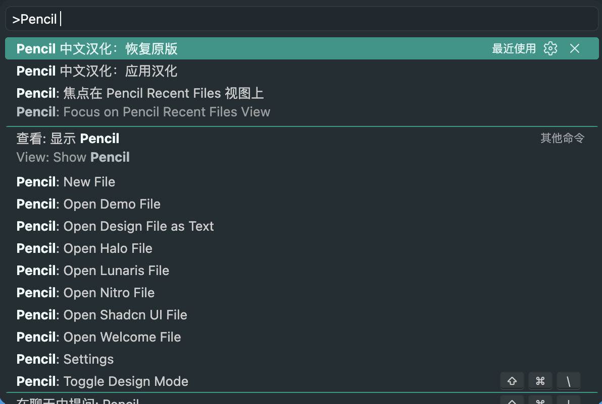
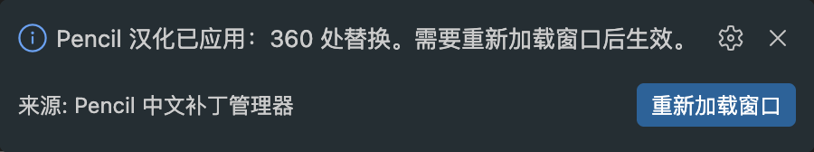
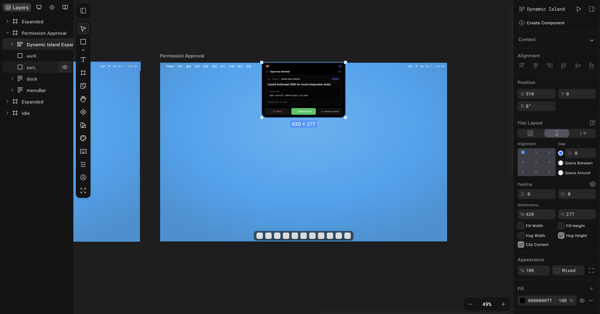
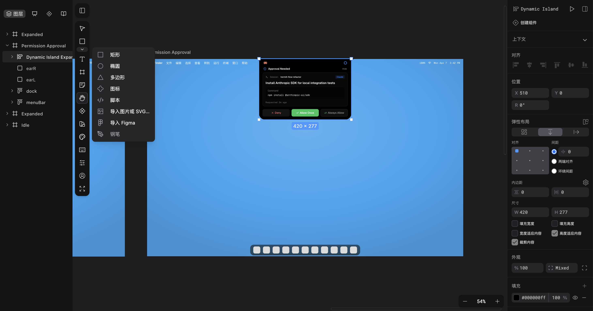
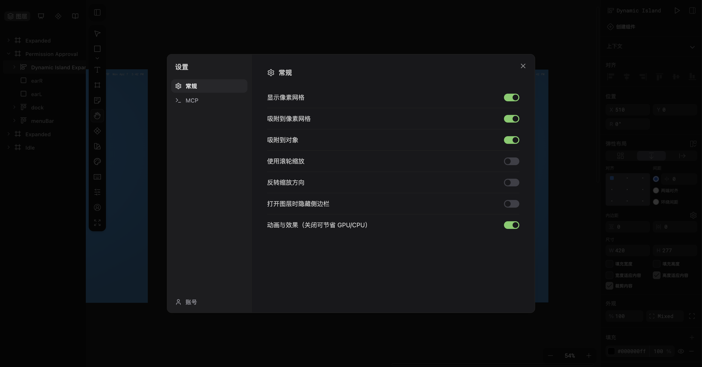
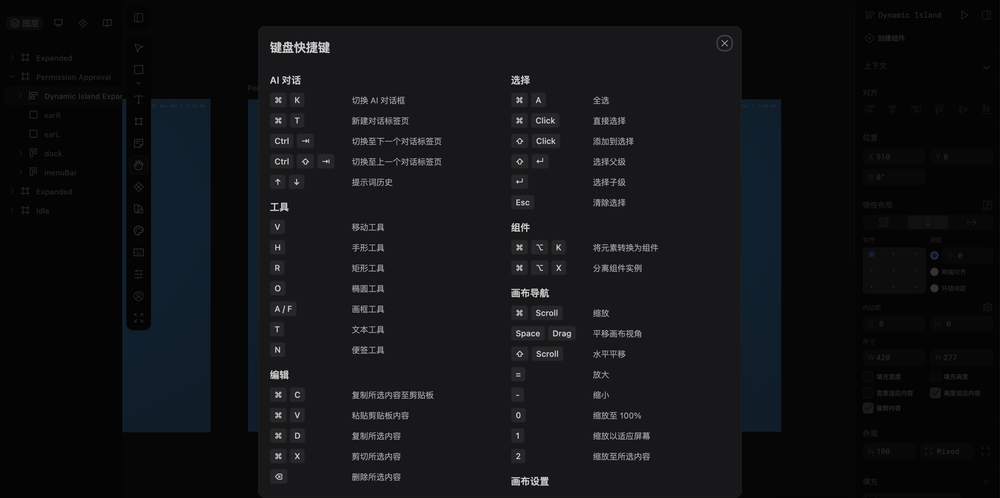
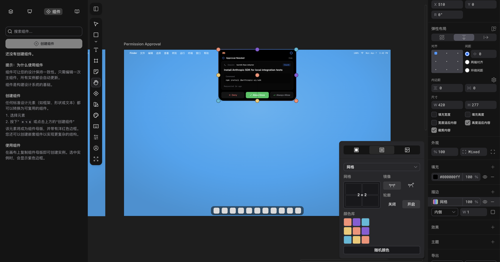

# Pencil-ZH

<p align="center">
  
</p>

Pencil-ZH 是一款专为 VSCode 扩展 Pencil 打造的中文翻译插件，一键将 Pencil 工具相关界面、功能提示汉化，适配各类设计场景，操作简洁，助力快速上手使用。

## Commands

- `Pencil 中文汉化：应用汉化`
- `Pencil 中文汉化：恢复原版`

## 效果图

### 应用汉化





### 汉化前



### 汉化后









## 更新 Pencil 后维护词条

如果 Pencil 更新版本后英文词条仍然存在，用户重新运行“应用汉化”即可。

如果 Pencil 新增或改动了英文文案，只需要在 `patches/translations.json` 里增量追加翻译词条，再重新打包发布 Pencil-ZH。也可以继续新增其他 `.json` 词典文件，扩展会自动合并。

```text
npm run check
```

可用下面的命令在当前 bundle 里定位词条：

```text
npm run scan-term -- "Frame"
```

## Notes

这个扩展不会自动监听或修改 Pencil 文件。Pencil 更新 editor bundle 后，汉化可能会被覆盖；重新运行“应用汉化”即可再次按当前词典替换。

补丁会在 Pencil globalStorage 下创建备份目录：

```text
.pencil-zh-backups/<patch-id>/
```

恢复原版只从备份恢复，不做反向字符串替换。
